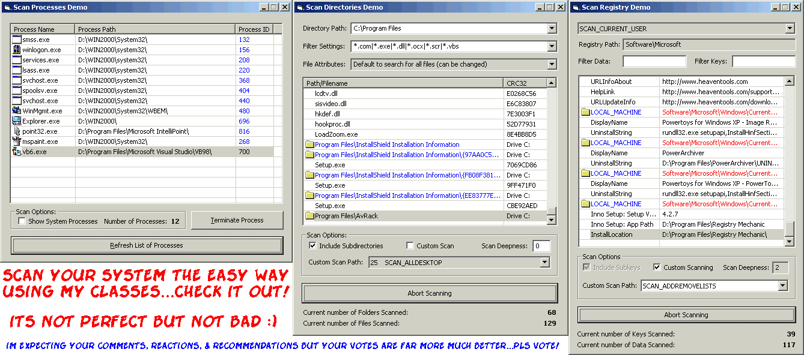



## VB Classes for Scanning the System

### Description

3 classes in vb6 for scanning the registry, files/folders,

and running processes in the system...the easy way.

fully configurable with extended features and stability that you really don't wanna miss.

this would be a good start for making anti-spywares, anti-virus programs, and more.

included in each of the 3 demos are 3 more classes for advance registry access, crc32 calculation, and getting file icon from executable and dll files.

PLEASE DONT FORGET TO VOTE. -noel
 
### More Info
 

             |
---                |---
**Submitted On**   |2005-12-03 09:45:10
**By**             |[Noel Dacara](https://github.com/Planet-Source-Code/PSCIndex/blob/master/ByAuthor/noel-dacara.md)
**Level**          |Advanced
**User Rating**    |4.9 (167 globes from 34 users)
**Compatibility**  |VB 6\.0
**Category**       |[Libraries](https://github.com/Planet-Source-Code/PSCIndex/blob/master/ByCategory/libraries__1-49.md)
**World**          |[Visual Basic](https://github.com/Planet-Source-Code/PSCIndex/blob/master/ByWorld/visual-basic.md)
**Archive File**   |[VB\_Classes1953541242005\.zip](https://github.com/Planet-Source-Code/noel-dacara-vb-classes-for-scanning-the-system__1-63457/archive/master.zip)

### API Declarations

PLEASE DONT FORGET TO VOTE. -noel

